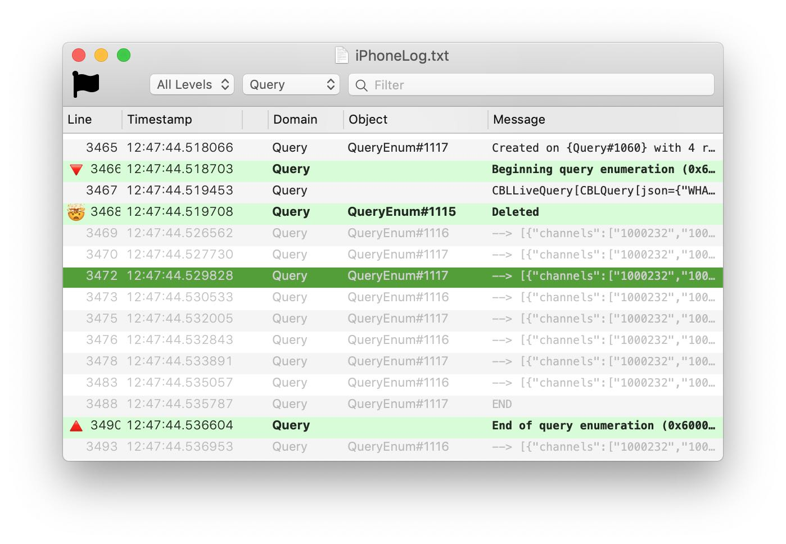

# Log Lady — a Couchbase Mobile log viewer

Log files are a great debugging and diagnostic tool, but they're difficult to work with. They get extremely long, and interesting events may be hundreds or thousands of lines apart. **Log Lady** is a specialized viewer for log files.

* Parses log files into organized table views
  * Doesn't grind to a halt on large files
  * Can directly read binary log files
  * Services menu item lets you select log text in another app and open it in Log Lady with one click
* Can filter to lines matching specific text, priority (verbose / info / warning...), category, or even a single object
* Highlights warnings, errors and debug-only messages
* Individual lines can be marked with various flags
  * Can filter to only flagged lines
  * Can scroll to the next or previous flagged line

## What kind of logs?

It would be wonderful to support all kinds of log files, but there are a near-infinite number of formats. We built this tool to look at Couchbase Mobile logs, so it only understands how to read those. Specifically:

* The Couchbase Lite binary format (`.cbllog`)
* The textual form that the binary format translates to
* Cocoa (iOS/macOS) logs
* Android logs
* Sync Gateway logs

If you feel like adding support for more formats, open up LogParser.swift and be prepared to craft some gnarly regular expressions. (Strongly recommended: the [Expressions](https://www.apptorium.com/expressions) app.)

## What does it run on?

macOS; any recent version from 10.11 up should suffice.

## Building it

1. Check out the repo
2. Open `Log Lady.xcodeproj` in Xcode (version 10 or later)
3. Build (Cmd-B) or Archive (you may need to adjust the code-signing settings)

... or just [download the latest release](https://github.com/couchbaselabs/LogLady/releases).
